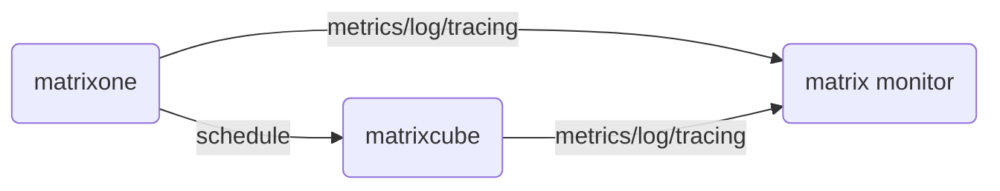
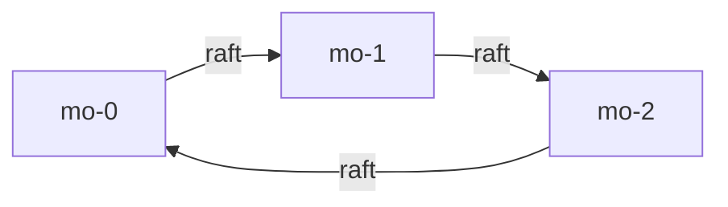
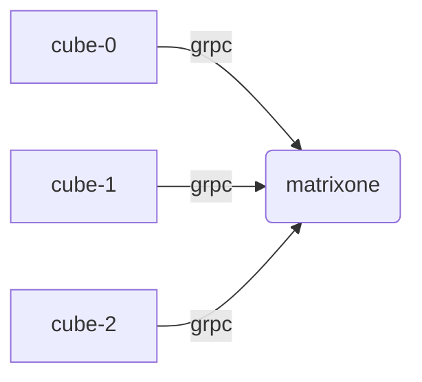
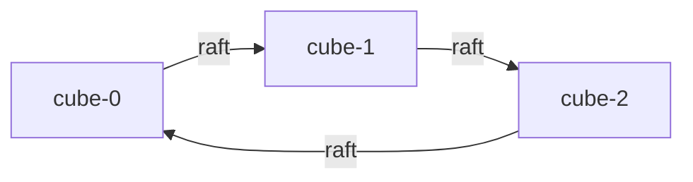
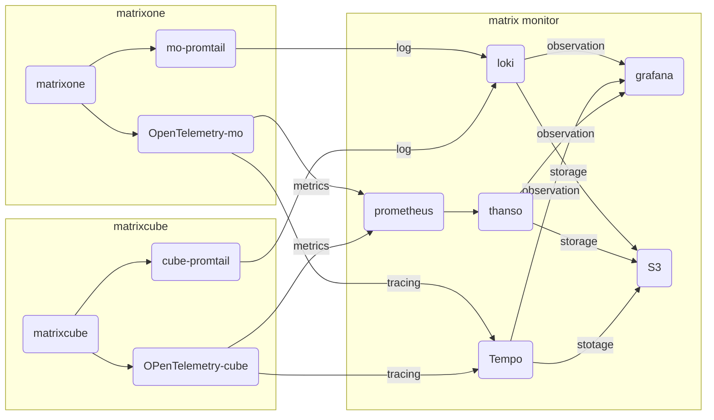
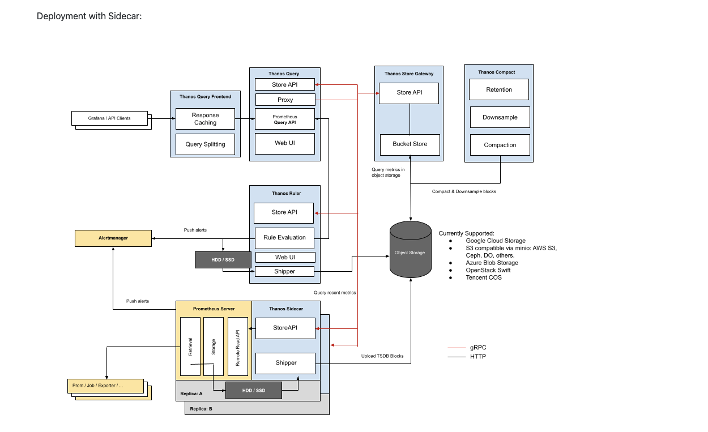
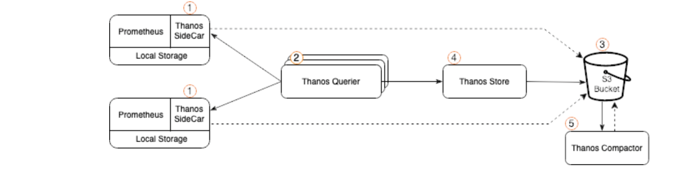

# Architecture

## Overview

## Matrixone

- matrixone as a compute layer
- default tree node for sechduler matrixcube

## Matrixcube

matrixone scheduler matrixcube

matrixcube consensus algorithm by raft

## Mmatrix monitor

thanos architecture

thanos as  prometheus sidecar

## why loki

- horizontally scalable
- highly available
- multi-tenant

## Metadata mangement

TODO

## State management

TDDO

## Stateful service management

TODO

## Backup

TODO

## References

- [Improving HA and long-term storage for Prometheus using Thanos on EKS with S3](https://aws.amazon.com/cn/blogs/opensource/improving-ha-and-long-term-storage-for-prometheus-using-thanos-on-eks-with-s3/)
- [Loki tutorial: How to send logs from EKS with Promtail to get full visibility in Grafana](https://grafana.com/blog/2020/07/21/loki-tutorial-how-to-send-logs-from-eks-with-promtail-to-get-full-visibility-in-grafana/)
- [From Distributed Tracing to APM: Taking OpenTelemetry & Jaeger Up a Level](https://logz.io/blog/monitoring-microservices-opentelemetry-jaeger/)
- [Intro to distributed tracing with Tempo, OpenTelemetry, and Grafana Cloud](https://grafana.com/blog/2021/09/23/intro-to-distributed-tracing-with-tempo-opentelemetry-and-grafana-cloud/)
- [Jaeger vs Tempo - key features, differences, and alternatives](https://signoz.io/blog/jaeger-vs-tempo#:~:text=Both%20Grafana%20Tempo%20and%20Jaeger%20are%20tools%20aimed,as%20a%20project%20from%20Cloud%20Native%20Computing%20Foundation.)
- [Metrics, tracing, and logging](https://peter.bourgon.org/blog/2017/02/21/metrics-tracing-and-logging.html)
- [利用Opentelemetry+Loki+Temp+Granafa构建端到端的可观测平台](https://juejin.cn/post/7050134410229710884)