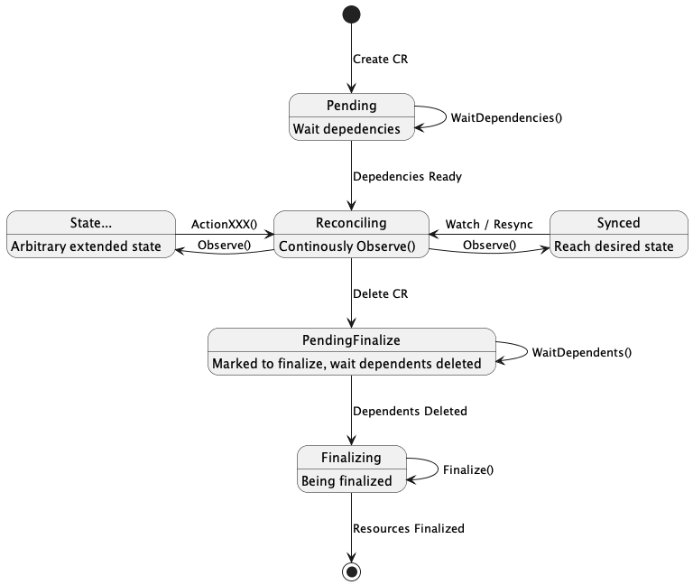

# MatrixOne Controller Runtime

| Status        | Proposed   |
:-------------- |:---------- |
| **Authors**   | @aylei     |
| **Freshness** | 2022-07-04 |

## Abstract

This proposal introduces a runtime framework to simplify the development and maintenance of the controllers in MatrixOne org.

## Background

[kubebuilder(controller-runtime)](https://github.com/kubernetes-sigs/kubebuilder) provides generic controller skeleton and leave the following problems to controller developers:

- State space of the controller keeps growing with the more sub-resources are added to be managed under an CR;
- Lack of effective Tracing and Metrics to help diagnose Reconcile problems;
- The need for large amounts of boilerplate code for each controller, which affects development efficiency.

These issues are mutually reinforcing: it is trivial to write some boilerplate and observability code for a single controller,
however, a monolithic controller suffers the complexity issue of state space explosion.

The proposed framework encourages decoupling the reconciliation of an complex object to multiple cohesive and simpler objects,
and provide template reconciler abstractions to eliminate the boilerplates of these simpler controllers.

### Goals

The framework aims to:

- Reduce the complexity of writing and maintaining controllers.
- Provide default Tracing context and Metrics output, without additional business code.
- Remove as much boilerplate code as possible;

## Proposal

### Overview

The framework is built upon [kubebuilder(controller-runtime)](https://github.com/kubernetes-sigs/kubebuilder).
It will provide template Reconcilers and expose [Actor interface](#actor) for upper layer to specify the resource specific reconciliation logic.
That is, generic Tracing, metrics, workflow (expressed as [inter-resource dependencies](#dependency-and-condition)) capabilities will be implemented in the runtime framework.

### Actor

Actor is the key abstraction for resource specific reconciliation logic:

```go
// Actor interface abstraction Reconcile logic, T is the type managed by the Actor, e.g. *v1alpha1.MatrixOneCluster
type Actor[T Object] interface {
    // Observe receives a ctx, which encapsulates the currently target object (see the Context interface for details).
    // Observe collects the actual State of the object, updates the `Status`, and determines the next `Action`
    // to be executed by the framework in order to drive the transition from actual state to the desired state. 
    // 
    // Framework behavior:
    // The framework will keep calling `Observe` and executing the Action returned until either:
    // 
    // - a nil `Action` is returned, which means the object reaches desired state;
    // - the object is deleted, which means there is only `Finalize` work to do;
    // 
    // For the first case, `Observe` is get called again when the object is requeued, 
    // e.g. a change of the object is watched by the informer.
    Observe(ctx Context[T]) (Action[T], error)

    // Finalize is a special Action that is get called by the framework when the object is deleted.
    // It execute the finalize work (e.g. cleanup sub-resources) and returns whether finalizing is done.
    // 
    // 
    // Framework behavior:
    // The framework will add a `Finalizer` to each object before entering actual reconciliation and
    // poll `Finalize` until it returns done before removing the `Finalizer`.
    Finalize(Context[T]) (done bool, err error)
}

// Context encapsulates the context of a conciliation, T is the type of the object to be reconciled, e.g. *v1alpha1.MatrixOneCluster
type Context[T] struct {
    context.Context // go context
    client.Client   // the k8s client of the k8s cluster where the target object is located

    // the object being reconciled
    Target T
    // the dependencies of the current object, refer to the later section for details
    Deps T

    // Trace records a span in the context of the current reconciliation
    // The framework uses the UID and ResourceVersion of the target object as tid to build a Tracing context that will
    // multiple reconciliation operations after a change into a Trace
    // The framework automatically logs Event and Span for Action calls, so application code usually does not need to call Trace() directly
    Trace(s Span) error
}

// Action defines an reconcile action
type Action[T Object] func(Context[T]) error {}
```

The basic template reconciler provided by framework would be like:

```go
type Reconciler[T Object] struct {
    Actor Actor[T]
}

func (r *Reconciler[T]) Reconcile(ctx context.Context, req ctrl.Request) (ctrl.Result, error) {
     // pseudo-code, omitting error handling, tracing, event
    ctx := Prepare(req)
    if WasDeleted(ctx.Target) {
        // wait for all upper-level dependencies of the current object to be deleted
        if !r.DependentsCleaned(ctx) {
            return Requeue{}, nil
        }
        // do finalizing, if not done, requeue
        return r.Actor.Finalize(ctx)
    }
    // wait dependencies ready
    if !r.DependenciesReady(ctx) {
        return Requeue{}, nil
    }
    // reconcile loop
    action := r.Actor.Observe(ctx)
    if action != nil {
        action()
        return Requeue{}, nil
    }
    // no action, forget the object until next resync
    return nil, nil
}
```

Reconciler states：



Each `Action` implicitly defines a state, and each time `Observe()` returns an Action it is a state transfer.
After the `Action` is executed, it returns to the Reconciling state and does another `Observe()` to determine the next state.
Always driving with `diff(actualState, desiredState)` without memorization allows the controller logic to not rely on event notifications,
so arbitrary event loss can be tolerated and failure recovery does not rely on persistent states other than the k8s apiserver.

Reconciler handles most of the sample logic and the actor would not worry boilerplate (at least not that much) thanks to generics.

### Dependency and Condition

Dependencies may exist between objects, for example, a compute layer component may rely on some status of the underlying storage layer component.
The dependencies between objects forms a DAG and implicitly defines the workflow of a group of objects:

- actions without inter-dependencies are executed by different reconcile coroutines (`goroutine` for go) that runs in one or more controller process;
- actions with inter-dependency automatically yield until all dependency conditions are met.

To materialize the dependencies, a top-level field `deps` is introduced in addition to `spec` and `status`.
While only the namespace and name are materialized of the depended objects, the `spec` and `status` of these objects would be populated at runtime.
This help eliminating the overhead of reflection and making static analyze easier, especially auto-completion.

Example goes below:

```go
type LogService struct {
    Spec   LogServiceSpec
    Status LogServiceStatus
}

type LogServiceStatus struct {
    Conditions
    HAKeeperEndpoint string
}

type DNGroup struct {
    Spec   DNSpec
    Status DNStatus
    Deps struct {
        // reference to the depended log service, only namespace and name are materialized
        //+mo:dependency:condition:=Ready
        //+kubebuilder:validation:Schemaless
        LogService *LogService
    }
}

type Conditional interface {
    Get() []Condition
    Set(Condition)
}

// Conditions implement Conditional
type Conditions []Condition
```

The comment `//+mo:dependency:condition:=Ready` instruct the codegen to generate the following code:

```go
func (c *DNGroup) RequireLogService(dep *LogService) *DNGroup {
    c.LogService = &LogService{
        Namespace: dep.Namespace,
        Name:      dep.Name,
    }
    return c
}

func (c *DNGroup) GetDependencies() []Dependency {
    var deps []Dependency
    deps = append(deps, Dependency{
        Object: c.LogService
        ReadyFunc: ConditionReady
    })
}
```

The `Conditional` interface helps the framework recognize the status of resources without reflection.
For thirdparty objects like `appsv1.Deployment`, reflection is necessary to recognize the status in the framework.

`Conditional` interface will also be used to expose metrics, the framework discovers all the resources the current controller
managed that implements `Conditional` interface and export the following metrics:

```text
mo_object_condition{kind="MatrixOneCluster", name="mo", namespace="default", condition="Ready"} 1
mo_object_condition{kind="MatrixOneCluster", name="mo", namespace="default", condition="Synced"} 1
```

It is trivial to alert unready clusters then, e.g. `mo_object_condition{kind="MatrixOneCluster", name="mo", namespace="default", condition="Ready"}==0`.

### Utilities

Since go 1.18 [does not support parameterized method](https://go.googlesource.com/proposal/+/refs/heads/master/design/43651-type-parameters.md#no-parameterized-methods),
we define utility functions that take `Context[T]` as a parameter, e.g.

```go
// Create
func Create[T](ctx Context, obj T) error
// Create + SetOwnerReference
func CreateChild[T](ctx Context, subresource T) error
// Create if exist update
func CreateOrUpdate[T](ctx Context, obj T, mutateFn func (o T)) error
// CreateOrUpdate + SetOwnerReference
func CreateOrUpdateChild[T](ctx Context, obj T, mutateFn func (o T)) error
// Wait all children with ownereference to be deleted
func Cleanup(ctx Context) error
```

These methods separate the concern of reconciliation and observability, e.g. tracing can be handled inside the utility.

### Example

```go
type DNGroupActor struct {}

func (r *DNGroupActor) Observe(ctx Context[*DNGroup]) (Action[*DNGroup], error) {
 return r.Sync, nil
}

func (r *DNGroupActor) Sync(ctx Context[*DNGroup]) error {
    CreateOrUpdate(ctx, &corev1.ConfigMap{
        Data: map[string]string{
            "config": fmt.Sprintf("ha-keeper-address=%s", ctx.Deps.LogService.Status.HAKeeperEndpoint),
        },
    })
    return CreateOrUpdate(ctx, &appsv1.StatefulSet{})
}

func (r *DNGroupActor) Delete(ctx Context[*DNGroup]) error {
 return Cleanup(ctx)
}

func (r *MoClusterActor) Create(ctx Context[*MatrixOneCluster]) error {
    logService := &LogService{}
    CreateOrUpdate(ctx, logService)
    dnGroup := &DNGroup{}
    // delare dependency
    dnGroup.RequireLogService(logService)
    CreateOrUpdate(ctx, dnGroup)
    return nil
}

func Setup(mgr ctrl.Manager) {
    NewReconciler[*MatrixoneCluster](&MoClusterActor{}).SetupWithManager(mgr)
    NewReconciler[*CNGroup](&CNGroupActor{}).SetupWithManager(mgr)
    NewReconciler[*LogService](&LogServiceActor{}).SetupWithManager(mgr)
}
```

### Package Management

- The framework should be a reside in a dedicated go module in order to be used across different controllers;
- The `api` package of each controller should be reside in a dedicated go module so that different controllers can reference each other seamlessly;

## Alternatives

- [Argo Workflow](https://argoproj.github.io/argo-workflows/): though both this framework and argo has the `Workflow` concept, argo is more suitable for
one-shot workflow like continuos delivery or batch job.

## Future Work

1. The workflow defined by a group of actors is implicit and we may need to visualize for better diagnosis it in the future;
2. The tracing of current design is limited to a single k8s resource. However, the top-level user interface requires collaboration of multiple resources, cross resource tracing would be helpful in such scenario.
