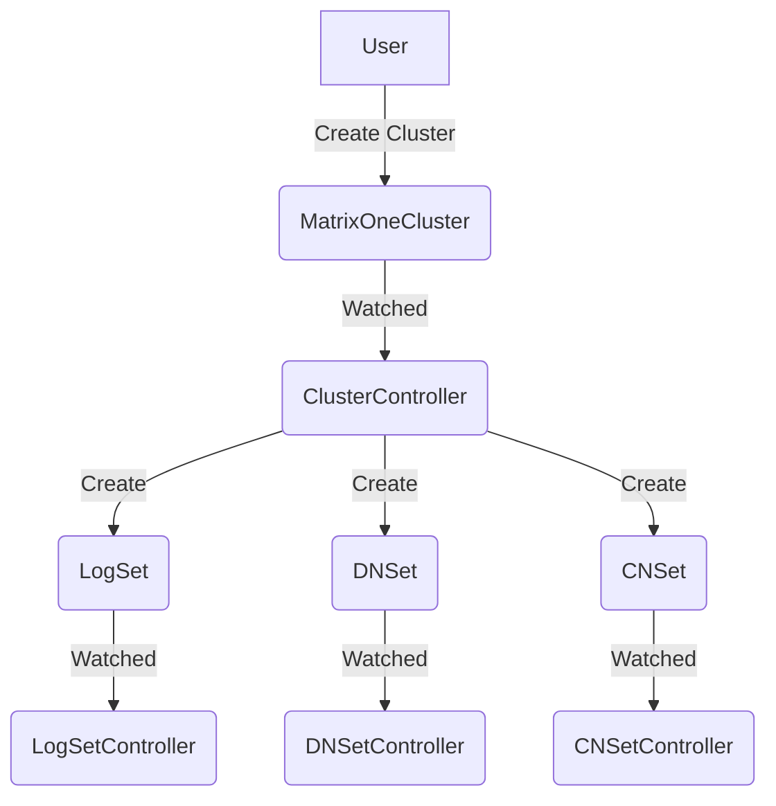
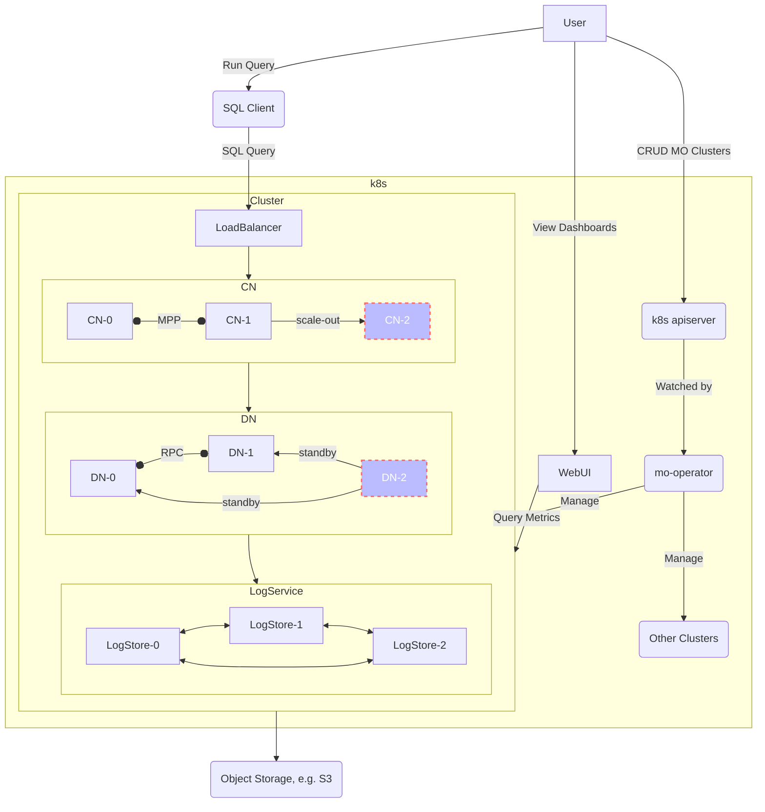
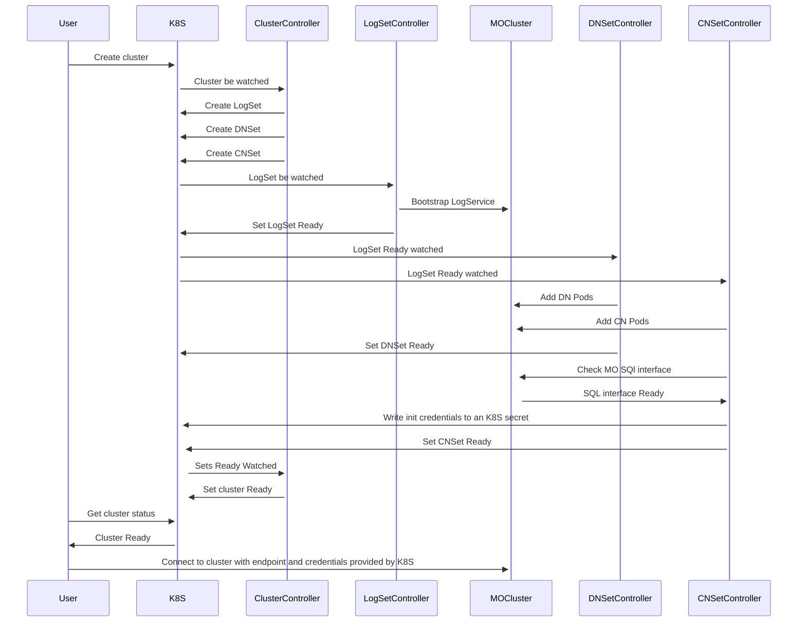

# MatrixOne Cluster Management on Kubernetes

| Status        | Proposed   |
:-------------- |:---------- |
| **Authors**   | @aylei     |
| **Freshness** | 2022-07-05 |

## Abstract

This proposal describes the top level design of matrixone-operator (mo-operator), which manages MatrixOne clusters (mo-cluster) on Kubernetes (k8s).

## Glossary

- `CR`: abbreviation of [custom resource](https://kubernetes.io/docs/concepts/extend-kubernetes/api-extension/custom-resources/), which is a kind of object we extend to k8s;
- `Controller`: controller is a worker for a certain kind of CR, mo-operator consists of a group of cohesive `Controller(s)`.

## Goals

mo-operator should:

- make it easy for the community to install the operator and manage mo-clusters;
- be highly customizable, so that it can be the cornerstone for building larger platforms like a database SaaS.

## Proposal

### Overview

With [mo-operator deployed](#operator-deployment), end users can manage mo-clusters on k8s via `kubectl` or programmatic client, e.g.

```shell
> cat>mo.yaml<<EOF
apiVersion: v1alpha1
kind: MatrixOneCluster
metadata:
 name: lapras
spec:
  cn:
    replicas: 1
  dn:
    replicas: 1
  log:
    replicas: 3
  ObjectStorage:
    s3:
      path: bucket/folder
  version: 0.5.0
EOF
> kubectl create -f mo.yaml
> kubectl get matrixonecluster lapras
```

The following `CRs` will be introduced:

- `CNSet`: manages a group of CN Pods;
- `DNSet`: manages a group of DN Pods;
- `LogSet`: manages a group of LogService Pods;
- `MatrixOneCluster`: manages a `LogSet`, a `DNSet` and a `CNSet` to provide a functional mo-cluster;

Conceptually, the flowchart after creating a `MatrixOneCluster` would be like:



Physically, all the CRs are served by the kubernetes apiserver and all the controllers are running in goroutines of the operator process concurrently.

It is worth noting that `MatrixOneCluster` object is not necessary to create a mo-cluster, one can create `LogSet`, `CNSet` and `DNSet` separately to form a fully functional cluster. Such decoupling enables the following capabilities without losing the simplicity for end user:

- advanced user can ignore `MatrixOneCluster` object perform fine-grained control over `*Set` directly;
- it is trivial to support heterogenous cluster: one simply deploy several `*Set` objects with different Pod specification;

An overview of the deployment topology:



### Cluster Deployment

Once a `MatrixOneCluster` object is created in k8s-apiserver, it is watched by the operator and the operator starts reconciling.

The `MatrixOneCluster` controller simply:

- create a `LogSet` object, a `DNSet` object and a `CNSet` object;
- wait them become ready;
- update the status of the `MatrixOneCluster` object to indicate the cluster is ready;

Component-specific controllers will take care of the management of each component.
The detailed design of `LogSet` controller has been elaborated in [LogSet](./2022-07-04-logset.md),
`DNSet` and `CNSet` controllers have similar but simpler behaviors so we omit the common details here and only discuss specific scenarios in the following sections.

Take the component-specific controllers into account, the sequence diagram would be like:



### Object Storage

The Operator is not going to manage object storage for users in the first version.
Documentations will be provided to guide users to setup a S3 compatible object storage (e.g. S3, minio) for the mo-cluster.

Credentials for the application process to access S3 will be injected by the Operator.
Official AWS SDK defines a well-known priority order to discover different credential sources from the environment, e.g. EC2 instance, identity federation, environment variables and credential configs.
The Operator will allow users to specify the following credential sources:

1. EC2 instance meta: no credential for DB process, the DB process will automatically discover whether it is running in an AWS EC2 instance and use the role of the instance to access the bucket. Only applicable for AWS S3.
2. Web identity: inject an identity token file to the container of the DB process and expose the file path of the token through environment variable, the DB process will automatically discover the token file, exchange temporary AWS credentials with this token and periodically refresh the credentials in memory. Only applicable for AWS S3;
3. Access key: the user creates a k8s secret containing keypair <AccessKey, SecretKey> and then references that secret when creating the mo-cluster. The access key and secret key will be injected into the environment variables of DB containers by the Operator. Applicable for all S3 compatible storage systems including AWS S3 and Minio.

The 1 and 2 sources are preferred since eliminating static credentials greatly improve security. But sometimes option 3 is unavoidable, e.g. neither the DB runs on EC2 nor there is a trusted issuer to issue secure identity token. In such case, the user is responsible to ensure the security of the static AK/SK, e.g. rotate it periodically.

### Auto Healing

The key benefit provided by Operator and k8s is auto healing failures.
Operator will provide the following automations:

- When a container fails, it will be automatically restarted;
- There are probes that periodically detect the liveness of containers and if the probing continuously fail for N times, the container is considered unhealthy and will be restarted automatically;
- When a stateless Pod is `Unready`, a new equivalent Pod will be created to keep the number of `Ready` replicas above a certain number;
- When a stateful Pod is `Unready`, a new Pod with a new UID and new persistent storage will be added to keep the number of `Ready` replicas above the certain number;
- Periodically GC unneeded Pods gracefully, including `Unready` stateless Pods and `Unready` stateful Pods that will not be useful even if it is recovered (which usually means all the states managed by this Pod has already been migrated to other Pods at application level).

> Define `Unready`?
>
> Besides the status of Pod reported by k8s, the Operator will also collect application level status like store liveness from HAKeeper to determine whether the application process runs in the Pod is functioning properly. So a Pod will considered `Unready` in the Operator even if Kubernetes claims it is `Ready`.

The combination of these automations can heal most of the minority failure scenarios automatically, for example:

1. If a process is OOM killed, it will be automatically restarted;
2. If the process continuously fails after restart (maybe OOM again), the Pod will eventually be recognized as unready and new Pod will be added to failover.

For application level knowledge, the detailed design of LogService can be found [here](./2022-07-04-logset.md). DN and CN are considered as generic stateless application in the first version of operator and the advanced orchestration knowledge like RO standby of DN and cache-awareness of DN/CN are left as future work.

### Cluster Validation

The cluster spec might have errors that cannot be validated by OpenAPI v3 schema, for example, the replica number of HAKeeper must be less or equal to the replicas of LogService since placing more than 1 HAKeeper replicas in one Pod is meaningless and should be avoided.

Therefore, the Operator will also act as a Kubernetes webhook to perform custom validations on `CRs` we defined above.

### Cluster Rolling-update

Cluster rolling-update happens when any of the configuration files, cluster version, environment variables, container resources or command-line arguments changed.

In current design, the cluster controller will blindly sync all changes to the spec of `LogSet`, `DNSet` and `CNSet`.
This implies that we assume each component takes care of its own availability during a rolling-update and there is no guarantee of the upgrading order between different components.
The rolling-update handling of `LogSet` is elaborated [here](2022-07-04-logset.md), `DNSet` and `CNSet` have similar behavior.

If the upgrade of mo-cluster requires certain ordering, e.g. upgrade LogService first, then DN and finally CN, cluster controller can be extended to support such policy in the future.

### Operator Deployment

An operator deployment consists of:

- A group of `CustomResourceDefinitions` that register the `CRs` mentioned above to k8s apiserver;
- A stateless Go application that can be deployed as a k8s `Deployment` with at 1 or more replicas (for HA purpose);
  - multiple operator replicas would perform leader-election via k8s apiserver (backed by ETCD) and only one replica is working at a time;
- RBAC policies that allows the operator to manage other k8s resources and cloud resource;

These resources and policies will be packaged into an all-in-one YAML file as well as an Helm chart, end users can deploy the operator with either of the following commands:

```shell
# install with kubectl, it is safe to assume every kubernetes users have kubectl installed
kubectl apply -f https://raw.githubusercontent.com/matrixorigin/matrixone-operator/main/deploy/all-in-one.yaml

# or install with helm chart (helm CLI is required but helm chart allows customization)
helm repo add matrixorigin https://charts.matrixorigin.io/
# install operator and override replicas to 3
helm install mo-operator matrixorigin/matrixone-operator --values operator.replicas=3
```

### Operator Upgrade

Upgrade operator will apply new reconciliation logic to all clusters once the replica in new version is elected as the reconcile leader.
This is dangerous for production-grade ochestration since erroneous operations applied to the alive clusters might cause large-scale failure and hard (if not impossible) to be undone.

Canary release of operators is introduced to tackle this problem. The webhook will add the current operator version to the label of the resources on the creation of resources and an Operator will filter resources by labels and only reconcile the resources that have the same version label with it. After a new version of Operator is rolled out, the old version will be kept, then:

1. All new resources will be labeled by the new version on creation;
2. The version label of existing resources should be updated to the new version proactively, either by a human operator or another automation process;
3. Once there are no resources with the old version label in the cluster, the Operator of the old version could be safely terminated.

### Observability

Operator observability:

1. the status of each resources can be retrieved via `kubectl` or programmatic k8s client;
2. the history status of each resources can be queried from Prometheus metrics, as designed in [mo-runtime](./2022-07-04-runtime.md);
3. the reconciliation details will be traced, as designed in [mo-runtime](./2022-07-04-runtime.md)

Cluster observability is provided by each mo-cluster natively.

We may provide out-of-box Grafana and Prometheus deployment and integration in the future, but for now this proposal decides to just provide documents to users to guide them setup the observability stack and focus on the cluster orchestration first.

### Local Evaluation

Amateur users may not have a k8s cluster to evaluate the distributed mo-cluster using Operator. A bad guess is to assume all amateur users have at least `docker` installed (which is not true of course) and we can then provide a docker container that bootstrap a k3d or kind cluster using docker, install operator and deploy a distributed mo-cluster for evaluation.

## Future Work

1. Security: mTLS, encryption at rest and cluster authorization (e.g. authorize the cluster to access general cloud resources) is not considered in this design and will be discussed separately;
2. Operator dryrun: automated operation can be risky in some cases like [Operator Upgrade](#operator-upgrade), it would be helpful if we can dryrun an operation before real apply it and have an human operator preview the execution plan;
