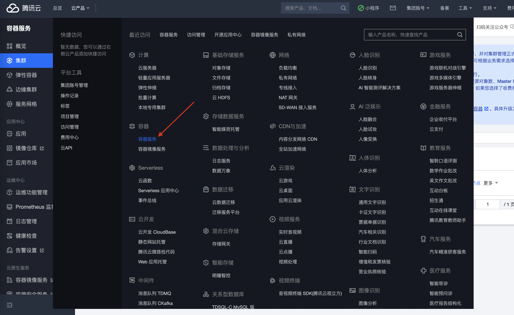
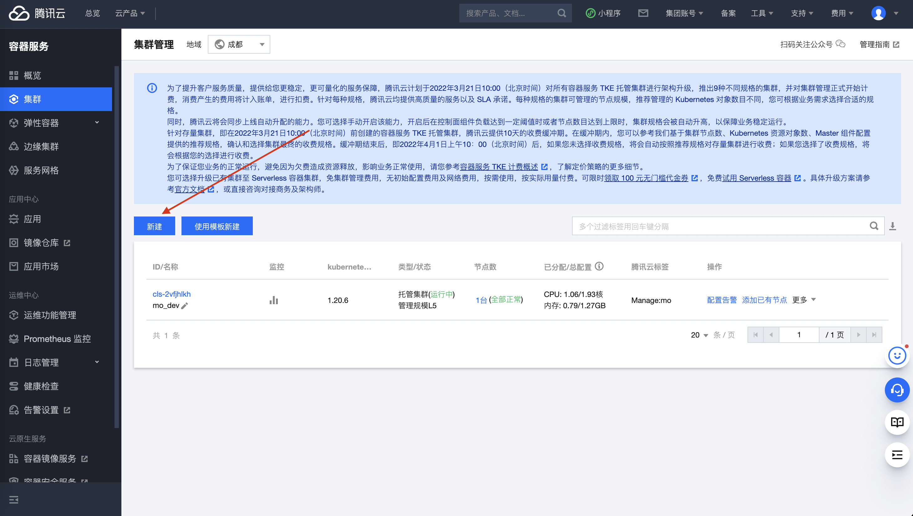
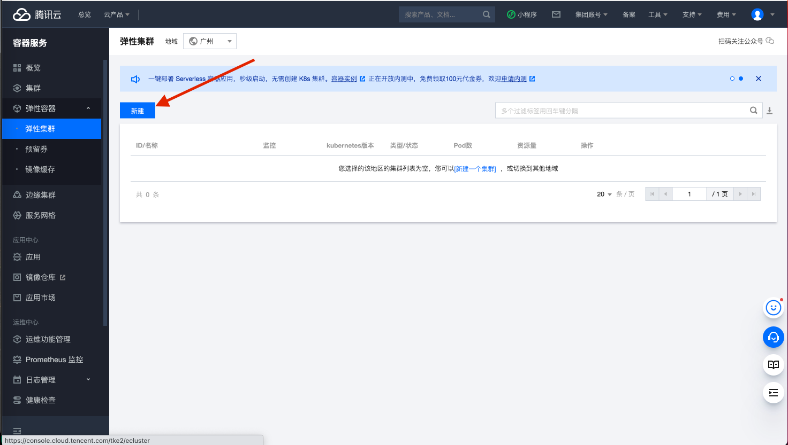
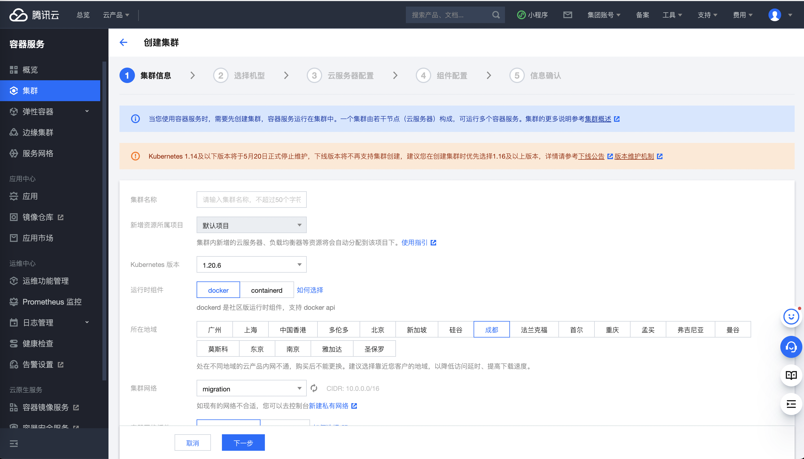
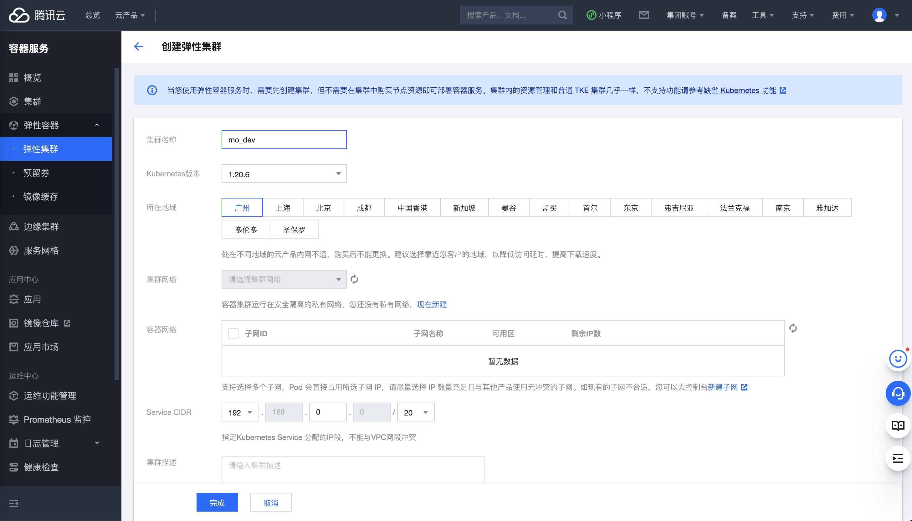
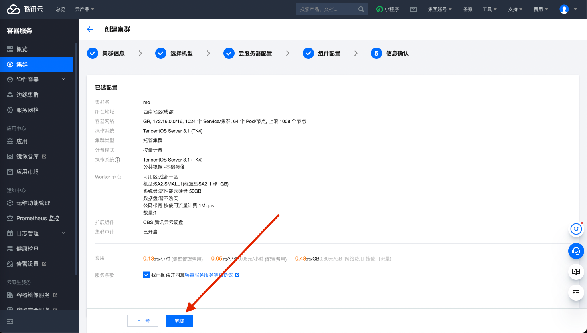
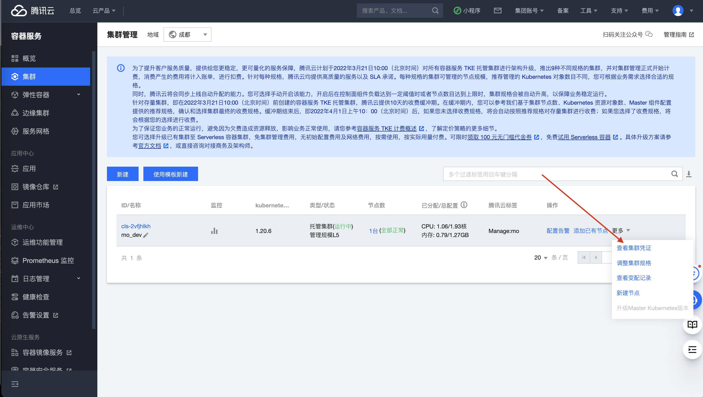
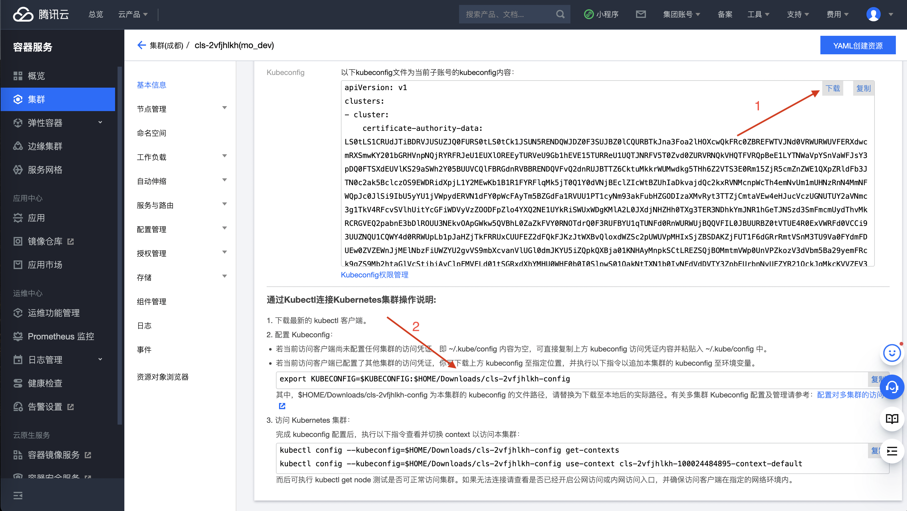
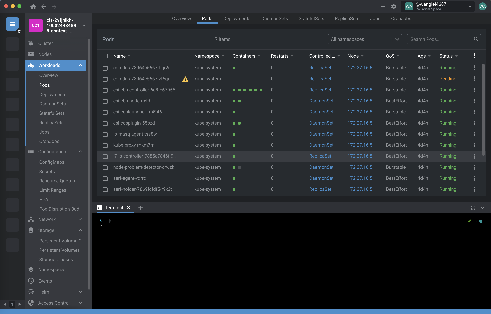
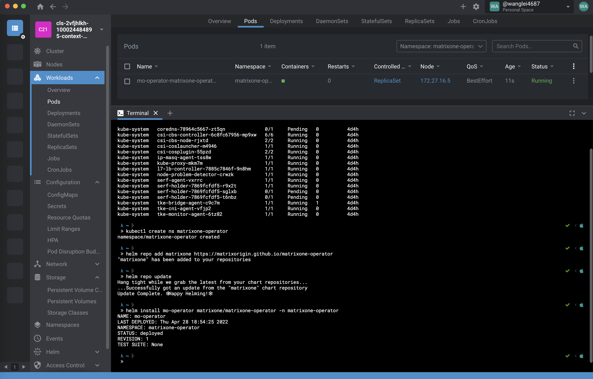

# Deploy matrixone on Tencent cloud

## Prerequired

- Tencent account (or sub account with [cam policy](https://cloud.tencent.com/document/product/598/10599))
- [Helm](https://helm.sh/)

## Create a tencnt cluster

1. Choosing  container image service:


2. Choosing cluster, then create new cluster (also you can choose default template to create cluster)

**Also can create elastic cluster**


3. Config your cluster (follow the step)

**Config a elastic cluster**


4. Finish configuration


5. Download kubeconfig
View cluster config

Download and config kubeconfig (also can copy config to [Lens](https://k8slens.dev))


Example on Lens


## Deploy matrixone operator

Follow the step on [docs/getting_started/Deploy Matrixone Operator](https://github.com/matrixorigin/matrixone-operator/blob/main/docs/getting_started.md#deploy-matrixone-operator)

For example on Lens:


## Deploy matrixone cluster

- An example spec to deploy a tiny matrixone cluster is included. Install cluster into `matrixone` namespace

```shell
# Create namespace
kubectl create ns matrixone

# Deploy a sample cluster
kubectl apply -f https://raw.githubusercontent.com/matrixorigin/matrixone-operator/main/examples/tiny-cluster.yaml -n matrixone
```

- Check Matrixone cluster status

```shell
kubectl get po -n matrixone
```

Matrixone cluster is ready:

```txt
NAME   READY   STATUS    RESTARTS   AGE
mo-0   1/1     Running   0          26s
mo-1   1/1     Running   0          26s
mo-2   1/1     Running   0          26s
```

## Connect to cluster

Follow steps on [docs/getting_started/Connect to a matrixone cluster](https://github.com/matrixorigin/matrixone-operator/blob/main/docs/getting_started.md#Connect-to-a-matrixone-cluster)
