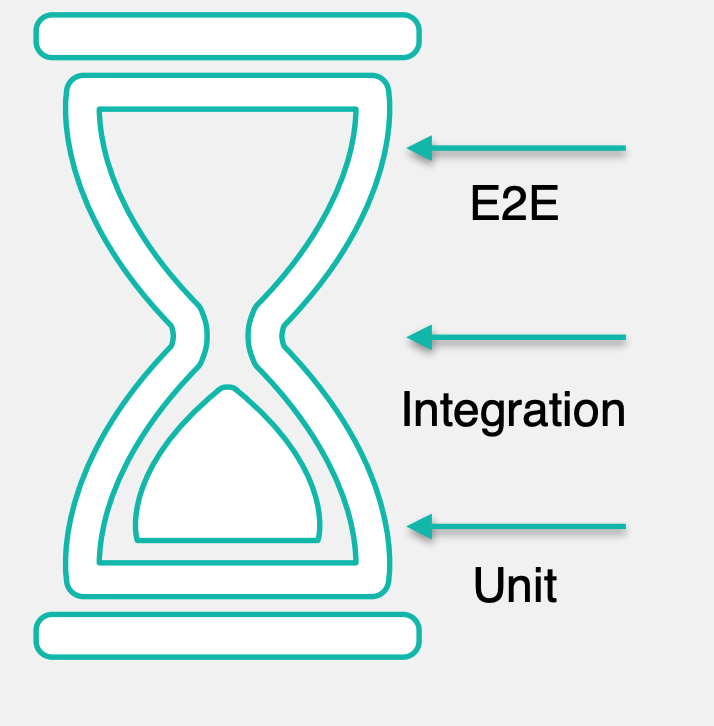
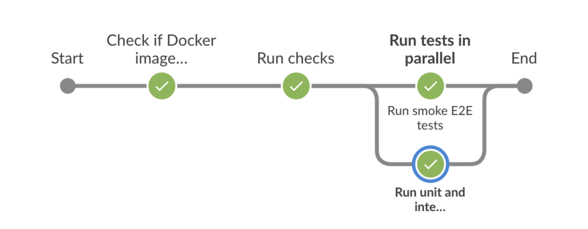
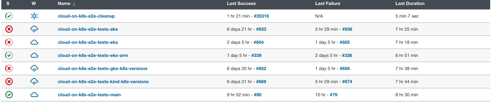

# Testing Matrixone Operator

Environment:

- GKE - Google Kubernetes Engine
- OpenShift - Kubernetes-based platform from Red Hat
- EKS - Amazon Elastic Kubernetes Service
- AKS - Azure Kubernetes Service
- ACS - Aliyun Kubernetes Service
- TKE - Tencent Kubernetes Engine
- Kind - Tool for running local Kubernetes clusters using Docker containers

## Unit tests

- Fake client helps with k8s interactions

## Disaster Recovery Testing (DiRT)

## E2E Tests

E2E tests in a nutshell

- Spawn a k8s cluster
- Deploy the operator
- run tests
  - Create an Matrixone cluster
  - Verify it's available, with the expected spec
  - Mutate the cluster
  - Verify it eventually has the expected spec
  - Continuously ensure no down time nor date loss during the mutation

 **The weight of various tests**
 

- Unit/integration tests for the entire reconciliation are hard
  - Using Ginkgo and Gomega for e2e test

- No guarantees that it will work on a real k8s cluster

## Test Case

E2E test case

- KillNodeSteps
- TestKillOneDataNode in reality

## Flaky tests

A flaky test is one that fails to produce the same result each time the same analysis is run. The build will fail only occasionally: One time it will pass, another time fail, the next time pass again, without any changes to the build having been made.

- Instrumentation for tests and Operator
- Send test results and k8s cluster data to Elasticsearch(or others log system) cluster for aggregation and analyze

## CI

Pre-commit verification

- Triggered by Github PR
- Run unit and integration test, linters, smoke E2E test, verifying Jenkins pipelines

Jenkins pipeline example

## Reference

- [Elastic Testing Kubernetes Operator](https://assets.ctfassets.net/ut4a3ciohj8i/52wiFLvLDxPX8ZflfaoEFI/37ddff93c561c61756b3a43f1bfb7571/100729_1996064486_Artem_Nikitin_Testirovaniye_Kubernetes_operatora_.pdf)
- [Testing Kubernetes Operators with Ginkgo, Gomega, and the Operator Runtime](https://itnext.io/testing-kubernetes-operators-with-ginkgo-gomega-and-the-operator-runtime-6ad4c2492379)
- [Kubernetes Test Infra](https://github.com/kubernetes/test-infra)
- [Flaky test living nightmare](https://www.smashingmagazine.com/2021/04/flaky-tests-living-nightmare/#:~:text=A%20flaky%20test%20is%20one,the%20build%20having%20been%20made.)
- [An empirical analysis of flaky tests](https://www.cs.cornell.edu/courses/cs5154/2021sp/resources/LuoETAL14FlakyTestsAnalysis.pdf)
- [Testing distributed systems](https://github.com/asatarin/testing-distributed-systems)
